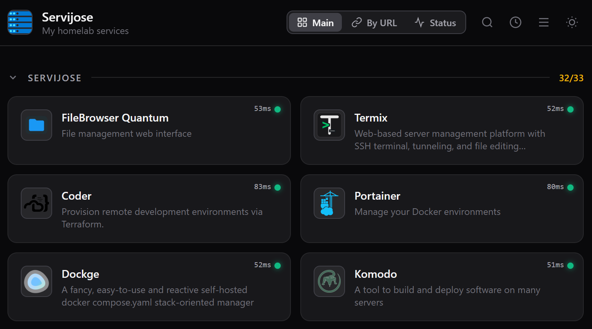

# Dockboard



A clean, self-hosted service dashboard for your homelab.  
Single config file, zero database, live health checks, multiple dashboard views.

---

## Features

- **Health badges** — each card shows a green/red dot checked on a configurable interval, with latency displayed
- **Dashboard views** (switchable from the header):
  - **Main** — your sections exactly as defined in `config.yml`
  - **By URL** — auto-groups services by IP address, then by domain pattern (e.g. `*.svjs.top`), then others
  - **Status** — groups services into Available / Down / Unchecked
  - **Docs** — renders configured markdown files and service `docs` directories as tabs
- **Collapsible sections** — click any section header to collapse/expand; state persists across reloads
- **Search** — live filter across the active dashboard by title, description or URL
- **Recent items** — clock icon in the header shows the last 10 opened services
- **Compact view** — toggle between normal and compact card layout
- **Light / dark mode** — persisted in `localStorage`
- **Icon fallbacks** — local file → SimpleIcons CDN → coloured initial avatar
- **Offline fallback** — config cached in `localStorage`; health checks fall back to client-side fetch when the server is unreachable
- **PWA** — installable as a web app

---

## Quick start with Docker (recommended)

The image is published automatically to GitHub Container Registry on every push to the `release` branch.

### 1. Copy the example files

```sh
cp config.example.yml config.yml
```

### 2. Configure your services

Edit `config.yml`:

```yaml
title: "My Homelab"
subtitle: "Self-hosted services"
health_check_interval: 60
domain_groups: "example.com"   # space-separated domain suffixes

sections:
  - name: Infrastructure
    items:
      - title: Portainer
        description: Manage Docker environments
        icon: portainer.png
        url: http://192.168.1.10:9443
```

### 3. Add icons (optional)

Drop `.png`, `.svg`, `.jpg` or `.webp` files into the `icons/` folder and reference them by filename in `config.yml`.

### 4. Start

```sh
docker compose up -d
```

Open **http://localhost:8080** (or whatever port you set).

---

## Build locally (from source)

```sh
# Clone and install
git clone https://github.com/<your-github-user>/dockboard.git
cd dockboard
npm install

# Configure
cp config.example.yml config.yml
# edit config.yml …

# Dev server (hot-reload)
npm run dev          # http://localhost:4321

# Production build + preview
npm run build
npm run preview
```

Or build the Docker image yourself:

```sh
docker build -t dockboard .
docker compose up -d
```

---

## Configuration reference

| Key | Type | Default | Description |
|---|---|---|---|
| `title` | string | `Dockboard` | Browser tab title and header title |
| `subtitle` | string | — | Optional subtitle below the title |
| `icon` | string | — | Filename inside `icons/` used as logo |
| `health_check_interval` | number | `60` | Seconds between health checks |
| `domain_groups` | string | — | Space-separated domain suffixes for URL-dashboard grouping |
| `docs` | list | — | Markdown files shown as tabs in Docs: `{ title, path }` |
| `readme` | string | — | Back-compatible single markdown file shown in Docs |
| `sections[].items[].docs` | string | — | Directory containing `README.md`, added as a Docs tab |
| `sections[].name` | string | — | Section heading |
| `sections[].items[].title` | string | — | Service name |
| `sections[].items[].description` | string | — | Short description (optional) |
| `sections[].items[].icon` | string | — | Icon filename inside `icons/` (optional) |
| `sections[].items[].url` | string | — | Service URL (used for the link and health check) |

---

## Environment variables

| Variable | Default | Description |
|---|---|---|
| `HOST` | `0.0.0.0` | Bind address |
| `PORT` | `4321` | Listening port |
| `CONFIG_PATH` | `<cwd>/config.yml` | Absolute path to config file |
| `ICONS_PATH` | `<cwd>/icons` | Absolute path to icons directory |

---

## Docker image publishing (CI/CD)

A GitHub Actions workflow (`.github/workflows/docker-publish.yml`) automatically builds and pushes a multi-arch image (`linux/amd64` + `linux/arm64`) to GitHub Container Registry on every push to the `release` branch and on version tags (`v*.*.*`).

Image tags produced:

| Trigger | Tags |
|---|---|
| Push to `release` | `latest`, `release` |
| Tag `v1.2.3` | `1.2.3`, `1.2`, `latest` |

---

## Project structure

```
dockboard/
├── .github/
│   └── workflows/
│       └── docker-publish.yml   # CI: build & push Docker image
├── icons/
│   ├── README.md
│   └── example-service.png      # placeholder icon (committed)
│   └── …                        # your icons (gitignored)
├── src/
│   ├── components/
│   │   ├── Header.astro          # title, dashboard switcher, search, recents
│   │   ├── Section.astro         # collapsible section with counter
│   │   └── ServiceCard.astro     # service card with status badge
│   ├── layouts/
│   │   └── Base.astro
│   ├── lib/
│   │   └── config.ts             # YAML loader + types
│   └── pages/
│       ├── index.astro           # main page + all dashboard logic
│       └── api/
│           ├── config.ts         # GET /api/config
│           ├── health.ts         # GET /api/health?url=…
│           └── icons/[file].ts   # GET /icons/<filename>
├── config.example.yml            # ← copy to config.yml
├── docker-compose.yml
├── Dockerfile
└── package.json
```

---

## License

MIT

